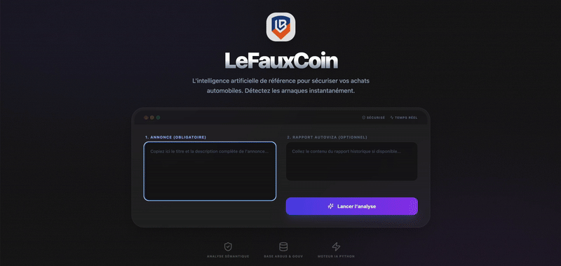

# LeFauxCoin - Algorithmic Car Scam Detector

**LeFauxCoin** is a high-precision security tool for second-hand car buyers. Unlike "black box" AI, it uses a **transparent, robust algorithm** backed by massive datasets to cross-reference listings against official market data and history reports.


## 🌐 Live Demo

You can test the application live at the following link:
👉 **[https://expert-argus-web-i4nt.onrender.com](https://expert-argus-web-i4nt.onrender.com)**

> ⏳ **Note:** Please **wait about 1 minute** for the server to load (cold start).

## 📸 Interface Preview




## About

> *"The absence of official statistics masks an alarming reality: odometer fraud affects at least **2.4% of used cars** in France. In a market of millions, this represents tens of thousands of vehicles potentially overpriced by up to €4,000."*

This project was born from a near-miss experience. I almost bought a car from a self-proclaimed "pro". I should have realized the listing didn't match the Autoviza report: the production year was off, the car was a German import, and there was a massive gap in the mileage history.

**But the rabbit hole went deeper.** I discovered this specific seller had a pattern of **opening and closing companies every 2 to 3 months** at different addresses. He was creating ephemeral legal shells to vanish the moment he sold a lemon, leaving buyers with no recourse.

I asked myself: **"Why isn't the platform flagging this?"** A simple algorithm could have spotted these screaming inconsistencies instantly. Instead, sellers like this prey on vulnerable buyers—often the elderly—who just want a small car and trust the "Pro" label. **LeFauxCoin** is that algorithm.

## Data & Scale

We didn't just guess the prices. We reverse-engineered the market.

* **34,000+** LeBoncoin pages scanned.
* **272,995** Unique listings processed and cleaned.
* **18,666** Unique market segments (Make/Model/Year/Engine) modeled.
* **13,337** Official Argus reference points correlated.

## Key Features

* **Deterministic Trust Score:** A transparent 0-100% score based on factual discrepancies, not hallucinations.
* **Market Value Engine:** Compares the listing price against our database of 270k+ transaction points to detect anomalies (too good to be true = scam).
* **Pro Seller Audit:** Real-time SIREN/SIRET API checks to detect **shell companies**. It flags sellers with very recent registrations or incoherent business activities (e.g., a bakery selling cars).
* **History Parser:** Automatically extracts key risk factors from Autoviza/Histovec reports:
    * **Import Detection:** High risk of odometer rollback.
    * **Mileage Gaps:** Alerts on "No data for X years".
    * **Inconsistency Check:** Ensures the car in the report is actually the car in the ad (Brand/Year matching).
* **⚡ Modern Dashboard:** A "One-Page" reactive interface designed for quick decision-making.

## 🏗️ Architecture

* **`client/`**: React + Vite + Tailwind (Frontend).
* **`backend/`**: Node.js (Orchestrator, API Gouv calls, Data crunching).
* **`ai_service/`**: Python (Pandas/Scikit-learn). Runs the pricing algorithm and heuristic models.

## Quick Start

1.  **Clone & Install:**
    ```bash
    git clone [https://github.com/YOUR_USERNAME/LeFauxCoin.git](https://github.com/YOUR_USERNAME/LeFauxCoin.git)
    cd LeFauxCoin
    chmod +x start.sh
    ./start.sh
    ```

2.  **Access:**
    Open [http://localhost:5173](http://localhost:5173).

## Deployment (Render.com)

This repo is **"Render Blueprint"** ready for a full-stack deployment.

1.  Push to GitHub.
2.  Create a new **Blueprint Instance** on Render.
3.  Connect this repo. Render will detect `render.yaml` and deploy both the Python analysis engine and the Node.js web server automatically.

## Contributing

We welcome contributions to make the algorithm even more robust against new scam tactics.

## License

This project is open-source and available under the [MIT License](LICENSE).